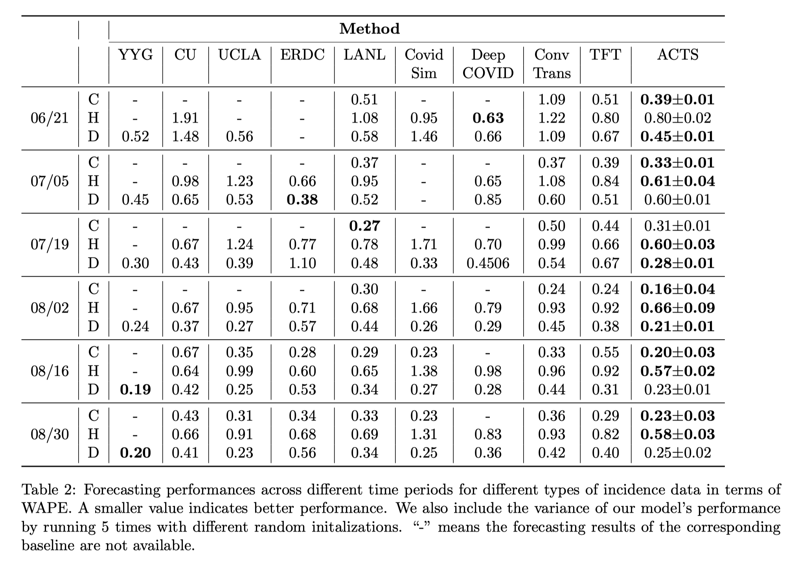

# Attention Crossing Time Series for COVID-19 forecasting

The repository contains scripts and outputs of COVID-19 forecasting developed by University of California, Santa Barbara. 

## Introdution
We employ a purely data-driven model named ACTS to forecast COVID-19 related data, e.g. confirmed cases, hospitalizations and deaths, along time. We assume that the development of the pandemic in the current region will be highly similar to another region with similar patterns a few months ago. We use attention mechanism to compare and match such patterns and generate forecasts. We also leverage additional features such as demographic data and medical resources to more precisely measure the similarity between regions.

## Architecture

## Evaluation and Sample forecasts

### Past forecasting accuracy as of Aug 31

For more details about our methodology, previous forecasts and comparison with other models, please refer to our [manuscript](https://arxiv.org/abs/2010.13006) on Arxiv.

### Recent forecasts on Nov 1

## Project Homepage
https://sites.cs.ucsb.edu/~xyan/covid19_ts.html
